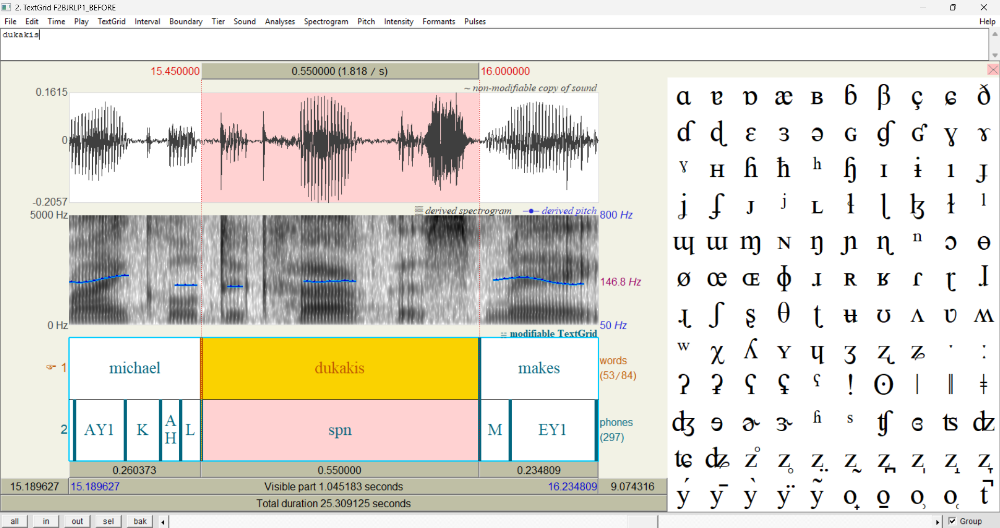
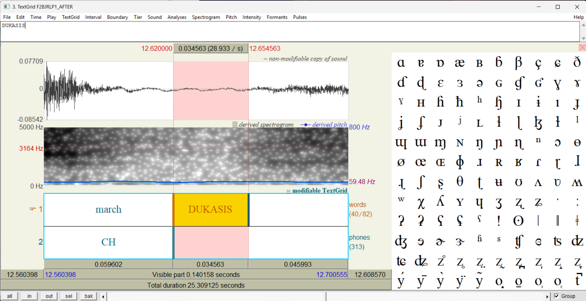

**#Project Overview**
This project uses Montreal Forced Aligner (MFA) to align speech audio with text at word and phoneme levels. I processed 6 audio files (~97 seconds) and improved alignment accuracy by manually handling out-of-vocabulary (OOV) words using custom phonetic pronunciations.
# Forced Alignment with Montreal Forced Aligner
I built an automatic speech alignment system using MFA that takes audio recordings and matches them with text transcripts at the word and phoneme level. Processed 6 audio files to get precise timing for every sound.

## What It Does

The system creates TextGrid files that show exactly when each word and sound happens in the audio. For example, if someone says "wanted" from 0.54-1.12 seconds, it breaks that down further - the "W" sound is at 0.54-0.60s, "AH" at 0.60-0.70s, and so on.

## Dataset

Worked with 6 audio files:
- 3 news broadcasts about judicial appointments (F2BJRLP1-3)  
- 3 short speech discrimination samples (ISLE files)
- Total: about 97 seconds of audio

## The Main Problem: Missing Words

When I first ran the alignment, the dictionary couldn't recognize 29 words. Most were:
- Proper names like Hennessy, Dukakis, Melnicove, Maffy
- Acronyms with punctuation: S.J.C.'s, WBUR's
- Specialized terms: de-politicize

I had to create phonetic pronunciations for these manually.

## Getting Started

See SETUP_INSTRUCTIONS.md for detailed installation steps.

Quick overview:
1. Install Python 3.10 (MFA breaks on 3.12)
2. Set up Miniconda
3. Create conda environment  
4. Install MFA via conda
5. Download the english_us_arpa dictionary and acoustic model

## Running the Alignment

Basic usage:
```bash
conda run -n mfa_conda mfa align \
  /path/to/corpus \
  english_us_arpa \
  english_us_arpa \
  /path/to/output
```

With custom dictionary for OOV words:
```bash
conda run -n mfa_conda mfa align \
  /path/to/cleaned_corpus \
  /path/to/custom_dictionary.dict \
  english_us_arpa \
  /path/to/output
```

## Fixing Out-of-Vocabulary Words

1. Run validation to identify which words are missing:
```bash
conda run -n mfa_conda mfa validate corpus english_us_arpa english_us_arpa
```

2. Create a pronunciations file using ARPA phonemes:
```
HENNESSY HH EH1 N AH0 S IY0
DUKAKIS D UW0 K AA1 K IH0 S
```

3. Merge with the base dictionary and re-run alignment

## Results

Created two sets of outputs:
- **before_oov/** - Initial alignment (some words failed)
- **after_oov/** - Improved alignment with custom pronunciations  

The improvement was measurable. For example, F2BJRLP1.TextGrid went from 1,540 to 1,596 lines after adding OOV pronunciations - more detailed phoneme boundaries.

## Project Structure
```
outputs/
├── before_oov/           Baseline TextGrids
├── after_oov/            Improved TextGrids
└── oov_pronunciations.txt

wav/                      Audio files
transcripts/              Text transcripts
praat_analysis/           Screenshots comparing before/after
```

## Tech Stack

- Montreal Forced Aligner 3.3.9
- Google Colab (for compute)
- Python 3.10 via Miniconda
- Pre-trained english_us_arpa models

## Problems I Hit

**Kaldi dependency errors**: Kept getting "_kalpy module not found". Turned out MFA needs conda installation, pip doesn't work.

**Text preprocessing issues**: Punctuation like periods and apostrophes broke the alignment. Had to clean transcripts (S.J.C.'s became SJC).

**Python version**: MFA doesn't support 3.12. Had to downgrade to 3.10.

## Analyzing Results with Praat

### Setup
1. Download from https://www.fon.hum.uva.nl/praat/
2. Extract and run Praat.exe (Windows might warn you - it's safe)

### Viewing Alignments
1. Open Praat
2. Load audio file: Open → Read from file → select .wav
3. Load TextGrid: Open → Read from file → select .TextGrid  
4. Select both, click "View & Edit"

You'll see:
- Waveform at top
- Spectrogram in middle
- Word tier and phoneme tier at bottom

### Zoom In
Click and drag to select 5-10 seconds, then click "sel" button to zoom.

### Before vs After Comparison
The difference is dramatic. In the BEFORE version, "Dukakis" shows up as "spn" (spoken noise) in the phoneme tier. In the AFTER version, it's properly segmented: D, UW, K, AA, K, IH, S.

See `praat_analysis/` folder for screenshots.


## Visual Results: Praat Analysis

### Before OOV Handling
The word "Dukakis" shows as "spn" (spoken noise) because it wasn't in the dictionary:



### After OOV Handling  
After adding custom pronunciation, "Dukakis" shows proper phoneme boundaries (D, UW, K, AA, K, IH, S):



### What This Shows
- **Top**: Audio waveform
- **Middle**: Spectrogram (frequency visualization)
- **Bottom tiers**: Word boundaries and phoneme segmentation

The improvement is clear - from generic "spn" to detailed phoneme-by-phoneme alignment.

## References

- [MFA Documentation](https://montreal-forced-aligner.readthedocs.io/)
- [Praat](https://www.fon.hum.uva.nl/praat/)
- [ARPA Phoneme Set](https://en.wikipedia.org/wiki/ARPABET)

## Takeaways

First time working with speech processing. Key lessons:
- Text cleaning is critical for NLP pipelines
- Dictionary coverage directly impacts alignment quality
- Environment setup is half the battle
- Phonetic transcription requires careful attention to pronunciation
